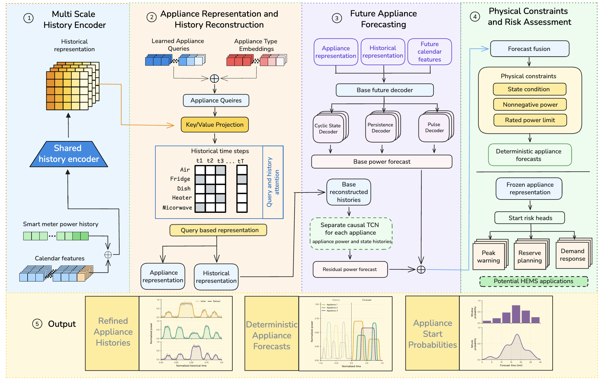

# PCSA: constraint-aware appliance power forecasting

Research code accompanying the revised *Energy and Buildings* manuscript,
“PCSA: Constraint-aware residential appliance power forecasting from smart-meter
histories.” PCSA forecasts appliance power from 120 minutes of aggregate
smart-meter readings and calendar features over a 30-minute horizon. Appliance
submeter data are required for supervised training and target-home adaptation;
inference uses aggregate history and calendar features only.

The code retains `pisa` in module names, command names, configuration keys and
archived output labels for checkpoint compatibility. In the manuscript, the
evaluated method is called **PCSA**. The output rules are operational constraints
and empirical guidance, not a governing-equation physics-informed neural
network.

## Architecture



*Figure 2 from the revised manuscript.* The source checkpoint contains a
historical refiner for compatibility, but the reported residual TCN reads the
**base reconstructed appliance histories**. Appliance-start risk and the HEMS
examples are optional downstream components; they do not change the
deterministic power forecast. The schematic includes a water-heater route,
whereas the reported experiments evaluate four observable channels: air
conditioner, refrigerator, dishwasher and microwave.

## Reported evaluation

The manuscript uses a fixed source home (7951) and three target homes (3039,
8386 and 8565) from the September 2018 Pecan Street extract. Chronological
splits use days 1–20 for training, 21–25 for validation and 26–30 for testing.
The source-home test comparison reports the mean and sample standard deviation
over seeds 7, 42 and 123:

| Method | Four-appliance Macro MAE (kW) |
| --- | ---: |
| PCSA | **0.074879 ± 0.000509** |
| Aggregate TCN | 0.078898 ± 0.000161 |
| Seq2Seq-NILM–TCN | 0.078913 ± 0.002386 |

The single-seed target-home analysis shows that 10% chronological support
reduces PCSA Macro MAE relative to its own zero-shot result by 19.0% on 3039,
3.7% on 8386 and 6.4% on 8565. PCSA has lower Macro MAE than aggregate TCN in
seven of twelve target-home/support settings, but does not have the lowest
Macro MAE among all three methods in any setting. Event recognition remains
weak and is not presented as a validated control capability. The optional
HEMSRISK-AWARE branch is separate from the reported deterministic forecast.

The files in `results/` document an **earlier two-stage transfer evaluation**.
They do not reproduce the manuscript's joint-head transfer table or its
three-seed source-home table. See `REPRODUCIBILITY.md` for the exact scope and
missing artifacts. Do not combine those archived transfer values with the
manuscript comparison.

## Repository contents

| Path | Contents |
| --- | --- |
| `src/` | Models, losses, data handling and evaluation metrics |
| `scripts/` | Data preparation, training and selected-checkpoint evaluation |
| `configs/observed/` | Saved configuration records; these are not generic defaults |
| `results/` | Archived scalar transfer results and a limited event audit |
| `tests/` | Synthetic regression tests that require no household data |
| `figures/Figure_2.png` | Architecture figure reproduced in this README |

Raw household records and checkpoint binaries are not included. The three
recorded configurations needed to train the documented seed-7 source model are
included below. Users can generate each checkpoint in sequence after obtaining
the data. The original GPU-server environment and a clean real-data rerun of
the manuscript's numerical results are not packaged here.

## Install and test

Python 3.11 is the locally tested version. Install a PyTorch build appropriate
for your CPU or CUDA environment, then install the remaining requirements:

```bash
python -m pip install -r requirements.txt
python -m unittest discover -s tests -p 'test_*.py' -v
```

The checked CPU environment used torch 2.2.2+cpu, NumPy 1.26.4 and pandas
2.2.3. `requirements.txt` is not a lockfile for the original GPU server.

## Obtain and prepare data

The electricity records are available through the official [Pecan Street
Dataport](https://dataport.pecanstreet.org/). Review the provider's [access and
licensing information](https://www.pecanstreet.org/access/) and obtain the
September 2018 exports for Homes 7951, 3039, 8386 and 8565 under your own
account. This repository does not redistribute those measurements.

The preparation command expects the original minute export, a second-level
export sorted by `dataid`, and the associated metadata:

```bash
python scripts/prepare_austin_sep_four_homes.py \
  --minute-csv data/raw/minute_export.csv \
  --second-csv data/raw/second_export_sorted_by_dataid.csv \
  --metadata-csv data/raw/metadata.csv \
  --output-dir data/austin_2018_sep_4homes
```

The processed data use one-minute kW values, availability flags and calendar
features. Missing appliance measurements must not be treated as zero. Source
training data determine normalization; target-home support uses the earliest
chronological 1%, 5% or 10% of eligible training windows.

## Train the documented source model

The manuscript describes two main training stages: base-route preparation
(Stage I) and residual-TCN fitting (Stage II). The saved Stage I preparation
has a base fit followed by an auxiliary historical-refiner pass, so exact
reproduction uses the commands below. Run them from the repository root after
preparing the data. The configuration runner translates each saved JSON
record to the arguments of `scripts/train_home7951.py`. All paths are
repository-relative.

```bash
python scripts/train_pcsa_from_config.py \
  --config configs/observed/pcsa_source_base_seed42_config.json
python scripts/train_pcsa_from_config.py \
  --config configs/observed/pcsa_source_history_seed42_config.json
python scripts/train_pcsa_from_config.py \
  --config configs/observed/pcsa_source_seed7_config.json
```

The first run fits the base model and writes
`outputs/runs/7951_base_auxlight_s42/checkpoints/best.pt`. The second run
initializes from that checkpoint and trains the historical refiner. The third
run initializes from the second checkpoint and fits the residual TCN using
**base**, not refined, reconstructed history. It writes
`outputs/runs/7951_tcn64x3_basehist_event0_e160_s7/checkpoints/best.pt`.
The historical refiner remains in this checkpoint for compatibility, although
its output is outside the reported future TCN input path.

Add `--dry-run` to any command to inspect the generated training command
without loading data or starting training. Each stage checks that its input CSV
and, where applicable, initialization checkpoint exist before it starts. The
provided seed-7 configuration documents one source run; reproducing the
manuscript's three-seed mean also requires the seed-42 and seed-123 source
run settings and evaluations. The archived seed-42 residual configuration is
`configs/observed/pisa_source_config.json`; no seed-123 configuration has been
supplied to this release.

## Other training and evaluation entry points

```bash
python scripts/train_home7951.py --help
python scripts/train_genuine_two_stage_home7951.py --help
python scripts/run_pisa_two_stage_transfer.py --help
python scripts/run_baseline_cross_home_transfer.py --help
```

The following command checks the source training entry point on processed
data. It is a one-epoch smoke run, **not** a manuscript reproduction:

```bash
python scripts/train_home7951.py \
  --csv_path data/austin_2018_sep_4homes/home_7951_2018_sep_1min.csv \
  --output_dir outputs/smoke --run_name source_demo \
  --device cpu --epochs 1 --batch_size 32 --num_workers 0 \
  --skip_test_evaluation
```

The archived selected-checkpoint evaluator requires the original run
directories and trusted checkpoint files. It checks saved validation MAE
before evaluating the test split:

```bash
bash scripts/run_transfer_selected_evaluation.sh --preflight_only
bash scripts/run_transfer_selected_evaluation.sh --homes 8565 --fractions 0.1
```

These commands evaluate the earlier two-stage transfer archive described in
`results/TRANSFER_RESULTS.md`; they are not commands for the manuscript's
joint-head transfer table. The event audit in that archive covers only Home
8565 at 10% support. PyTorch checkpoint loading uses pickle, so load only
checkpoints from a trusted source.

For dataset layout, checkpoint requirements and evaluation boundaries, see
`REPRODUCIBILITY.md`. `NOTICE.md` records the current licensing and data
distribution status.
